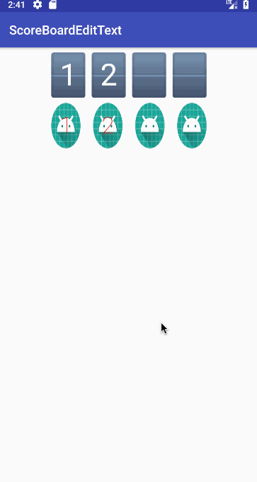

# ScoreBoardEditText

[](https://jitpack.io/#dyguests/ScoreBoardEditText)

A EditText with score board ui style.



## Usage

```gradle
	// Add it in your root build.gradle at the end of repositories:
	allprojects {
		repositories {
			...
			maven { url 'https://jitpack.io' }
		}
	}

	// Add the dependency
	dependencies {
	        implementation 'com.github.dyguests:ScoreBoardEditText:0.1.0'
	}
```